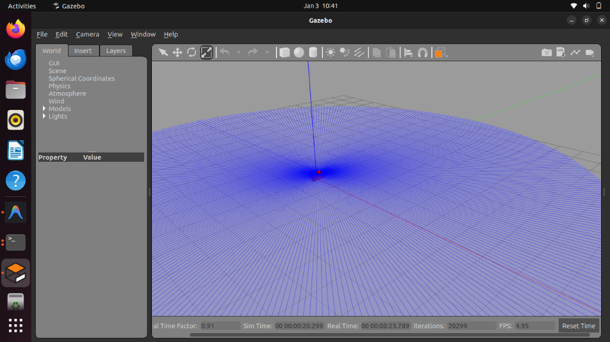

# 🤖 Public-Space Robot State Awareness & Explainability System

[](https://docs.ros.org/en/humble/index.html)
[](https://gazebosim.org/home)
[](LICENSE)

An advanced ROS 2-based system designed to improve human-robot interaction in public spaces. This system externalizes a robot's internal perception, confidence, and task state through real-time visualization (Gazebo "Thought Bubble") and natural language explanations.


*Robot visualizing Lidar scan data while navigating a public space populated by dynamic actors.*

---

## 🌟 Key Features

- **🧠 Cognitive Introspection**: Real-time monitoring of sensor health and task performance.
- **🛡️ Uncertainty Estimation**: Heuristic-based calculation of global robot uncertainty based on sensor quality.
- **🗣️ Explainability Publisher**: Maps complex robot states into human-interpretable language (System 2 Awareness).
- **🎭 Gazebo Visualizer**: A custom C++ plugin (`StateVisualizerPlugin`) that renders internal robot states (e.g., Error = Red Sphere) directly in the simulation.
- **⚡ Fault Injection**: A dedicated node to simulate sensor failures (e.g., Lidar blackout) to test the robot's self-awareness.
- **👥 Dynamic Environment**: Includes walking pedestrians (Gazebo Actors) to simulate a realistic public space.

## 🏗️ System Architecture

The system is composed of localized ROS 2 nodes and a Gazebo visualization plugin:

```mermaid
graph TD
    A[Gazebo Lidar/Sensors] -->|Raw Data| B(Sensor Health Monitor)
    A -->|Raw Data| FI(Fault Injector)
    FI -->|Degraded Data| B
    B -->|SensorStatus.msg| C(Task State Manager)
    B -->|Confidence| D(Uncertainty Estimator)
    C -->|RobotState.msg| E(Explainability Publisher)
    D -->|Uncertainty.msg| E
    E -->|String Explanation| F[User / Observer]
    C -->|ROS Topic| G[Gazebo "Thought Sphere"]
    D -->|ROS Topic| G
```

## 🚀 Getting Started

### Prerequisites
- **Ubuntu 22.04 LTS** (Native recommended)
- **ROS 2 Humble**
- **Gazebo Classic (Gazebo 11)**

### Installation & Build

1. **Clone the repository**:
   ```bash
   cd ~/ros2_ws/src
   git clone https://github.com/hxrnoorsingh/ros2-practice.git
   ```

2. **Build the workspace**:
   ```bash
   cd ~/ros2_ws
   colcon build --symlink-install
   source install/setup.bash
   ```

## 🧪 Testing the System

### 1. Launch the Simulation
Launch the public space world, the robot, and all cognitive nodes:
```bash
ros2 launch explainable_robot system_classic.launch.py
```

### 2. Verify Explanations
In a new terminal, monitor the robot's real-time internal monologue:
```bash
ros2 topic echo /explanation
```

### 3. Inject a Fault (Test Awareness)
Force a Lidar failure to see if the robot detects it and explains the situation:
```bash
ros2 service call /toggle_fault std_srvs/srv/SetBool "{data: true}"
```
*Expected Output:* The robot should stop, a **Red Alert Sphere** should appear above it, and the explanation should read: *"I have stopped because of a system malfunction. CAUTION: I detect TOTAL FAILURE of lidar."*

## � Future State & Roadmap

We are actively working towards:
1.  **Large Language Model (LLM) Integration**: Replacing rule-based explanations with an LLM that can generate context-aware, conversational responses about the robot's intent.
2.  **Web-Based Dashboard**: Moving the visualization from Gazebo-specific plugins to a web interface (using Foxglove or similar) for easier remote monitoring.
3.  **Complex Navigation Scenarios**: integrating Nav2 for full autonomous point-to-point navigation in crowded spaces.
4.  **Audio Output**: Adding a Text-to-Speech (TTS) module so the robot can verbally Announce its state to nearby pedestrians.

---
*Developed as a research prototype for Human-Robot Interaction.*
