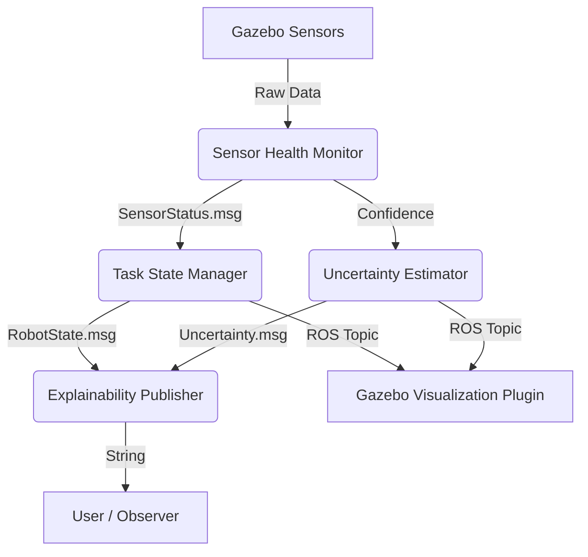

# 🤖 Public-Space Robot State Awareness & Explainability System

[](https://docs.ros.org/en/humble/index.html)
[](https://gazebosim.org/home)
[](LICENSE)

An advanced ROS 2-based prototype designed to improve human-robot interaction in public spaces. This system externalizes a robot's internal perception, confidence, and task state through real-time visualization and natural language explanations.

---

## 🌟 Key Features

- **🧠 Cognitive Introspection**: Real-time monitoring of sensor health and task performance.
- **🛡️ Uncertainty Estimation**: Heuristic-based calculation of global robot uncertainty.
- **🗣️ Explainability Publisher**: Maps complex robot states into human-interpretable language.
- **🎭 Gazebo Visualizer**: A custom C++ plugin that renders internal robot states directly in the simulation.
- **🧩 Modular Architecture**: Decoupled nodes for sensing, reasoning, and transparency.

## 🏗️ System Architecture

The system is composed of four specialized ROS 2 nodes and a Gazebo visualization plugin:



## 🚀 Getting Started

### Prerequisites
- **Ubuntu 22.04 LTS** (Native recommended)
- **ROS 2 Humble**
- **Ignition Gazebo Fortress**

### Installation & Build

1. **Clone the repository**:
   ```bash
   cd ~/ros2_ws/src
   git clone https://github.com/hxrnoorsingh/ros2-practice.git
   ```

2. **Build the workspace**:
   ```bash
   cd ~/ros2_ws
   colcon build --symlink-install
   source install/setup.bash
   ```

## 🧪 Testing the System

### 1. Launch the System
Launch the simulation and all cognitive nodes:
```bash
ros2 launch explainable_robot system.launch.py
```

### 2. Verify Internal Logic
In a new terminal, monitor the robot's real-time explanations:
```bash
source ~/ros2_ws/install/setup.bash
ros2 topic echo /explanation
```

### 3. Headless Plugin Verification
If you are testing on a server or a machine without GUI acceleration, verify that the C++ plugin is successfully loaded and watching the state:
```bash
export IGN_GAZEBO_SYSTEM_PLUGIN_PATH=~/ros2_ws/install/explainable_gazebo_plugins/lib:$IGN_GAZEBO_SYSTEM_PLUGIN_PATH
ign gazebo -s -v 4 -r ~/ros2_ws/src/worlds/public_space.world
```
Look for: `[INFO] [gazebo_state_visualizer]: StateVisualizerPlugin configured for model: explainable_robot`

## 📜 Design Rationale

In public robotics, **transparency is trust**. This project moves beyond mere navigation by providing answers to the observer's silent questions:
- *What is the robot doing?*
- *Is it aware of its surroundings?*
- *Does it need help or space?*

By visualizing "System 2" reasoning (uncertainty and health) in addition to "System 1" actions (movement), we align the robot's behavior with human mental models.

## 🤝 Contributing

Contributions are welcome! If you have ideas for better uncertainty heuristics or more immersive visualizations, feel free to open a PR.

---
*Developed as a research prototype for Human-Robot Interaction.*
